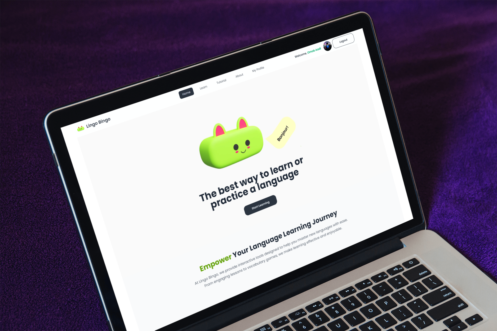

<div align="center">
  
</div>

# 🌟 **Lingo Bingo: A Vocabulary Learning Application** 🌟

**Lingo Bingo** is a fun and interactive language learning platform designed to make vocabulary acquisition engaging and enjoyable. Whether you're a beginner or looking to refine your skills, Lingo Bingo has something for everyone! 🎉

---

## 🌐 **Live Demo**

- 🔗 [Visit Lingo Bingo](https://lingo-bingo-ornobaadi.surge.sh)  
- 🔗 [Firebase Hosted Link](https://lingo-bingo-6af61.web.app/)

---

## 🎯 **Overview**

Lingo Bingo helps users overcome the challenge of retaining vocabulary by offering an easy-to-use and interactive learning experience. With dynamic lessons, interactive tutorials, and engaging features, mastering a new language has never been this fun! 🚀

---

## ✨ **Core Features**

- 🔑 **Firebase Authentication**: Secure login and registration with Google social login.
- 🗂️ **Dynamic Lessons**: Vocabulary cards categorized by difficulty.
- 🛠️ **Profile Management**: Update name and profile picture directly in the app.
- 🎥 **Embedded Tutorials**: Curated YouTube videos for immersive learning.
- 🎨 **Interactive UI**: Smooth animations powered by AOS.
- 🗣️ **Pronunciation Feature**: Hear correct pronunciations of vocabulary words.
- 🔁 **Private Routes**: Seamless navigation with protected routes.
- 📈 **Responsive Design**: Optimized for mobile, tablet, and desktop devices.

---

## 📦 **Dependencies**

- **React Router DOM**: For navigation and routing.
- **React Firebase Hooks**: Simplifies Firebase integration.
- **Firebase**: Handles authentication and database services.
- **React Hot Toast**: Displays sleek toast notifications.
- **React Count Up**: Adds animated counters.
- **AOS (Animate On Scroll)**: Provides scroll-based animations.

---

## 🛠️ **Getting Started**

Follow these steps to run **Lingo Bingo** locally on your machine:

1. **Clone the Repository**  
   ```bash
   https://github.com/ornobaadi/Lingo-Bingo.git
   ```

2. **Navigate to the Project Directory**  
   ```bash
   cd Lingo-Bingo
   ```

3. **Install Dependencies**  
   ```bash
   npm install
   ```

4. **Set Up Environment Variables**  
   Create a `.env` file in the root directory and add your Firebase configuration:
   ```env
   VITE_API_KEY=your_firebase_api_key
   VITE_AUTH_DOMAIN=your_project_auth_domain
   VITE_PROJECT_ID=your_project_id
   VITE_STORAGE_BUCKET=your_storage_bucket
   VITE_MESSAGING_SENDER_ID=your_messaging_sender_id
   VITE_APP_ID=your_app_id
   ```

5. **Start the Development Server**  
   ```bash
   npm run dev
   ```

6. **View the Application**  
   Open your browser and go to [http://localhost:5173](http://localhost:5173).

---


## 🔗 **Additional Resources**

- [Live Project on Surge](https://lingo-bingo-ornobaadi.surge.sh)
- [Firebase Hosted Link](https://lingo-bingo-6af61.web.app)
- [React Documentation](https://reactjs.org/)
- [Firebase Documentation](https://firebase.google.com/docs)

---

🚀 Dive into the world of vocabulary and make learning a breeze with **Lingo Bingo**! 🌟
